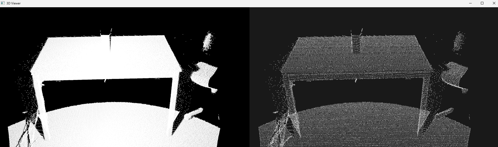
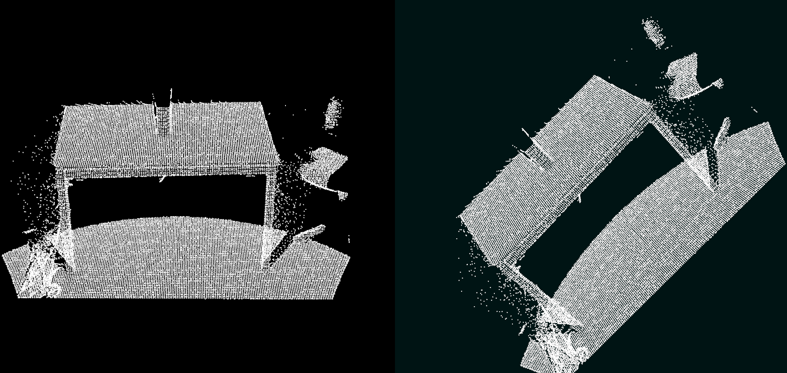
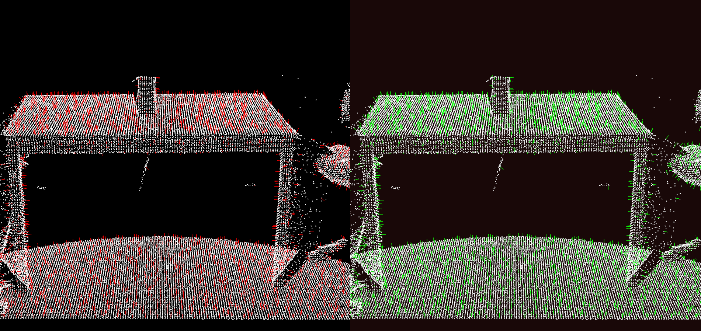

# Downsampling a PointCloud Using a VoxelGrid Filter

This project is a small C++ Point Cloud Library (PCL) example that demonstrates how to reduce the number of points in a dense point cloud using a `VoxelGrid` filter.

The program:

- loads a `.pcd` point cloud file,
- downsamples it by grouping nearby points into fixed-size 3D voxels,
- writes the filtered result back to disk,
- opens three PCL comparison visualizations for filtering, transformation, and normal-estimation analysis.

## What the Project Does

The executable defined in [CMakeLists.txt](CMakeLists.txt) is built from a small multi-file layout:

```text
project/
├── include/
│   ├── PointCloudProcessor.h
│   └── Visualizer.h
├── src/
│   ├── main.cpp
│   ├── PointCloudProcessor.cpp
│   └── Visualizer.cpp
├── CMakeLists.txt
├── vcpkg.json
├── README.md
└── .gitignore
```

Responsibilities are split as follows:

- `PointCloudProcessor` loads, downsamples, and saves the `.pcd` data.
- `Visualizer` displays three side-by-side comparison windows.
- `main.cpp` wires the workflow together.

At runtime, the code performs these steps:

1. Reads `table_scene_lms400.pcd` into a `pcl::PCLPointCloud2` object.
2. Prints the number of input points and available fields.
3. Applies a `pcl::VoxelGrid` filter with a leaf size of `0.01f x 0.01f x 0.01f`.
4. Prints the number of points after filtering.
5. Saves the result as `table_scene_lms400_downsampled.pcd`.
6. Estimates normals on the downsampled cloud with both kNN (`k=20`) and radius (`r=0.03`) search.
7. Applies a Z-axis rotation transform to create a rotated downsampled cloud.
8. Displays three split-window comparisons for direct visual evaluation.

## Visualization Results

1. **Original vs Downsampled:** this view shows how voxel-grid filtering reduces point density while preserving the global scene structure.
2. **Downsampled vs Rotated Downsampled:** this view confirms the geometric transform by comparing the same filtered cloud before and after rotation.
3. **kNN Normals vs Radius Normals:** this view highlights how neighborhood definition changes estimated surface normal directions and local smoothness.

## Result Screenshots







## Why VoxelGrid Filtering Is Useful

Point clouds captured from LiDAR, RGB-D cameras, or 3D scanners often contain far more points than are needed for many downstream tasks. A `VoxelGrid` filter reduces that density by dividing space into a 3D grid and replacing all points inside each voxel with a representative point.

This gives you a smaller cloud that is usually:

- faster to process,
- easier to visualize,
- more practical for registration, segmentation, and feature extraction pipelines.

The tradeoff is detail: smaller leaf sizes preserve more geometry, while larger leaf sizes produce stronger compression.

## Why Normal Estimation Is Useful

Normal estimation gives each point a local surface direction, which is a key geometric cue for many 3D tasks.

With reliable normals, you can improve:

- segmentation quality (separating planes, edges, and object boundaries),
- feature extraction and matching,
- registration and alignment robustness,
- surface reconstruction and meshing,
- visualization and inspection of local shape changes.

In this project, comparing kNN-based and radius-based normal estimation helps show how neighborhood choice affects normal stability, smoothness, and sensitivity to local point density.

## Experimental Work in This Repository

This repository includes experimental work in addition to the base voxel downsampling example.

Current experimental topics include:

- comparing original, downsampled, and transformed point clouds,
- evaluating normal estimation behavior with different neighborhood strategies (kNN vs radius),
- iterating on visualization outputs and parameter settings for analysis.

These experiments are intended for learning and exploration, so interfaces, parameters, and outputs may evolve over time.

## Build Configuration in This Workspace

This workspace is configured as a CMake project using:

- CMake presets,
- the `Ninja` generator,
- the `msvc-vcpkg` configure preset,
- Microsoft C++ compiler (`cl.exe`),
- dependencies installed through `vcpkg` using the manifest in [vcpkg.json](vcpkg.json).

The preset is defined in [CMakePresets.json](CMakePresets.json) and writes build output to:

- `build/msvc-vcpkg`

The project links against PCL components for common utilities, I/O, filtering, and visualization.

## Important Runtime Requirement

The source code loads the input file using a relative path:

- `table_scene_lms400.pcd`

That means the file must be available in the program's current working directory when the executable runs, or the code will exit with:

```text
Error: Couldn't read file table_scene_lms400.pcd
```

The generated output file is:

- `table_scene_lms400_downsampled.pcd`

## How to Build

From the workspace root, a typical preset-based build is:

```powershell
cmake --preset msvc-vcpkg
cmake --build --preset msvc-vcpkg
```


- Install vcpkg
- Set `VCPKG_ROOT` environment variable, e.g.
```powershell
[System.Environment]::SetEnvironmentVariable(
  "VCPKG_ROOT",
  "C:\Users\Gakbulu\vcpkg",
  "User"
)
```
Otherwise, CMake will not find dependencies.

If you are building through VS Code with CMake Tools, use the same preset and build the `MyCppCode` target.

## How to Run

Make sure `table_scene_lms400.pcd` is available where the executable will look for it, then run the built program from the build directory:

```powershell
.\build\msvc-vcpkg\MyCppCode.exe
```

When it succeeds, you should see:

- console output reporting point counts before and after filtering,
- a new downsampled `.pcd` file written to disk,
- three comparison windows for filtering, transformation, and normal-estimation methods.

## Source Files

- [src/main.cpp](src/main.cpp): entry point and application flow.
- [src/PointCloudProcessor.cpp](src/PointCloudProcessor.cpp): point cloud loading, filtering, and saving.
- [src/Visualizer.cpp](src/Visualizer.cpp): three side-by-side PCL comparison visualizations.
- [include/PointCloudProcessor.h](include/PointCloudProcessor.h): processing interface.
- [include/Visualizer.h](include/Visualizer.h): visualization interface.
- [CMakeLists.txt](CMakeLists.txt): target definition and library linkage.
- [CMakePresets.json](CMakePresets.json): preset-based build configuration.

## Notes for This Setup

If PCL visualization headers or libraries are missing in this environment, the `visualization` feature of PCL may not be installed in `vcpkg`. In that case, install the visualization-enabled PCL package before rebuilding.
